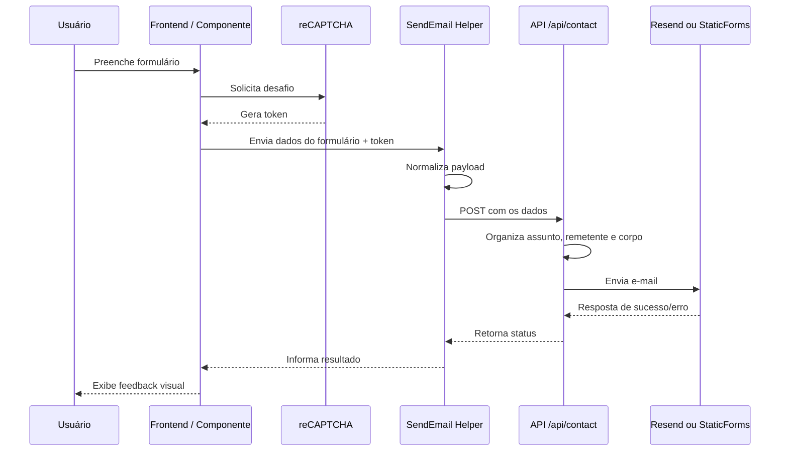
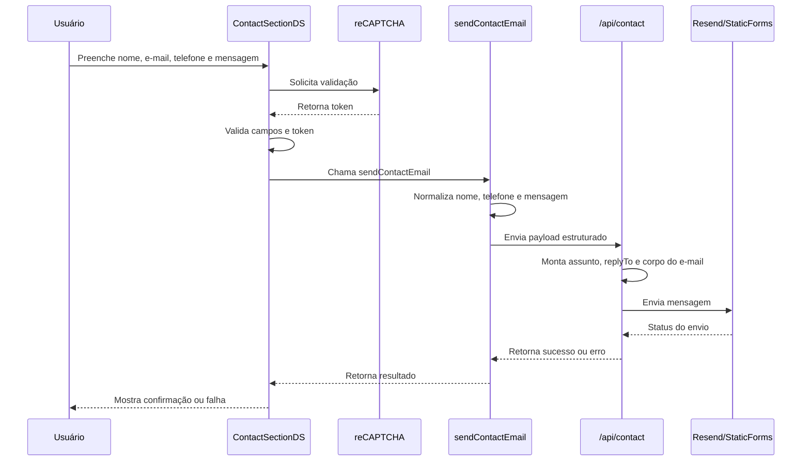
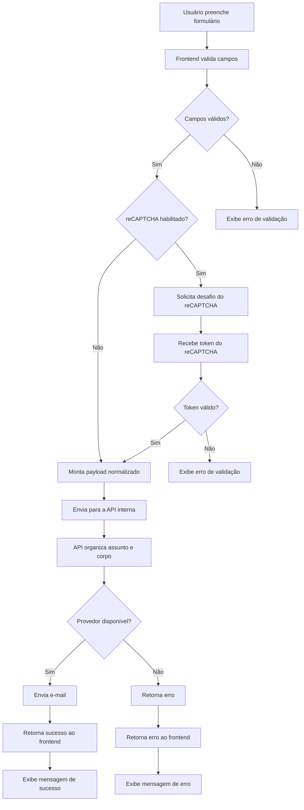
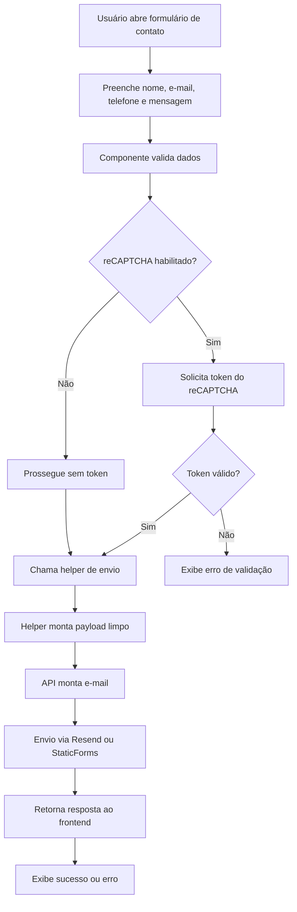
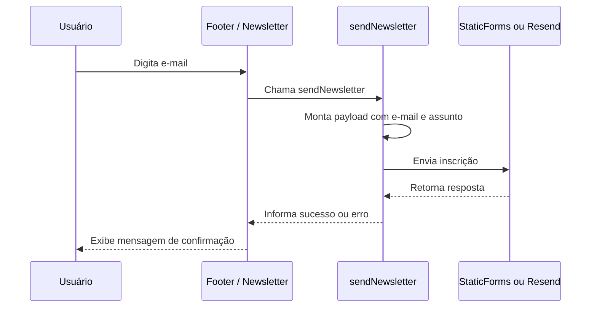
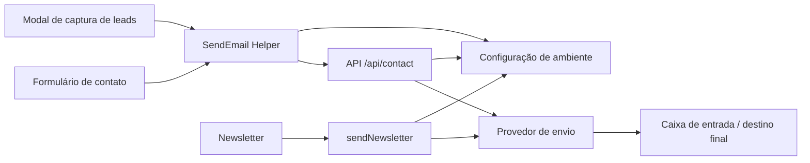

# Manual do Sistema de E-mail do Projeto

## Visão geral

Este projeto utiliza um sistema de envio de e-mail baseado em formulários do frontend, uma camada de utilitário compartilhada e uma rota de API do Next.js para centralizar o processamento das mensagens.

O objetivo principal é padronizar o envio de mensagens provenientes de formulários como:

- captura de leads
- formulário de contato
- newsletter

O fluxo foi pensado para permitir:

- reutilização de código entre formulários
- validação do conteúdo antes do envio
- compatibilidade com diferentes provedores de e-mail
- centralização das chaves e endpoints em um único módulo de configuração

---

## Arquitetura do sistema

### 1. Frontend

Os formulários ficam nas páginas e componentes do projeto, por exemplo:

- [src/components/devsolar/estructure/body/main/contact_section_ds.js](src/components/devsolar/estructure/body/main/contact_section_ds.js)
- [src/components/devsolar/estructure/body/header/ModalCapturaLead.jsx](src/components/devsolar/estructure/body/header/ModalCapturaLead.jsx)
- [src/components/devsolar/estructure/body/footer/footer_ds.js](src/components/devsolar/estructure/body/footer/footer_ds.js)

Esses componentes:

- coletam os dados do usuário
- fazem a validação básica do formulário
- chamam a função compartilhada de envio
- exibem feedback visual de sucesso ou erro

### 2. Utilitário compartilhado de e-mail

O ponto de entrada comum está em:

- [src/components/devsolar/utility/email/SendEmail.ts](src/components/devsolar/utility/email/SendEmail.ts)

Esse arquivo é responsável por:

- construir o payload do formulário
- normalizar dados como nome, e-mail, telefone e mensagem
- decidir se o envio vai para a API interna do Next.js ou para um endpoint externo
- serializar os dados no formato esperado pelo provedor

### 3. API interna do Next.js

A rota usada para processar os formulários é:

- [src/app/api/contact/route.ts](src/app/api/contact/route.ts)

Essa rota funciona como um backend leve para o site. Ela recebe os dados enviados pelo frontend, organiza o conteúdo em um formato limpo e escolhe o provedor de envio.

Essa camada é importante porque:

- evita que o formulário envie dados diretamente de forma improvisada no navegador
- centraliza a montagem do e-mail
- permite usar estratégias mais confiáveis de envio, como Resend, quando configurado

### 4. Configuração de ambiente

As configurações de e-mail estão centralizadas em:

- [src/lib/email-config.ts](src/lib/email-config.ts)

Esse módulo define variáveis como:

- endpoint do StaticForms
- chave de acesso do StaticForms
- destinatário principal
- remetente configurável
- chave da API de Resend, quando existir
- flag de reCAPTCHA

### 5. Newsletter

A newsletter possui um fluxo separado, embora compartilhe a mesma lógica de envio em parte:

- [src/components/devsolar/utility/newsletter/sendNewsletter.ts](src/components/devsolar/utility/newsletter/sendNewsletter.ts)

Esse módulo é usado para enviar a inscrição da newsletter para o provedor configurado.

---

## Como o sistema funciona no geral

O fluxo padrão é o seguinte:

1. O usuário preenche um formulário no frontend.
2. O componente chama a função de envio compartilhada.
3. A função monta um payload com os dados do formulário.
4. O payload é enviado para a rota interna do Next.js.
5. A rota interna organiza o conteúdo em um formato legível para e-mail.
6. O sistema tenta enviar a mensagem:
   - via Resend, se a chave estiver configurada
   - ou via StaticForms, se for o caminho fallback
7. A resposta é retornada ao frontend, que mostra mensagem de sucesso ou erro.

---

## Componentes principais

### 1. Formulário no frontend

Responsável por:

- capturar os dados do usuário
- validar campos obrigatórios
- chamar a função de envio
- mostrar o status da operação

### 2. Função compartilhada de envio

Responsável por:

- unificar a lógica entre formulários
- normalizar dados
- construir o payload final
- decidir o endpoint de destino

### 3. Rota de API

Responsável por:

- receber os dados enviados
- limpar os campos
- gerar um conteúdo de e-mail mais organizado
- enviar para o provedor escolhido

### 4. Provedor de envio

Atualmente o projeto pode usar:

- Resend, quando a variável de ambiente estiver configurada
- StaticForms, como fallback para compatibilidade

---

## Exemplo de funcionamento: formulário de captura de leads

O formulário de captura de leads é o mais simples de entender porque ele reúne poucos campos, mas ainda envia uma mensagem estruturada.

### Onde ele está

- [src/components/devsolar/estructure/body/header/ModalCapturaLead.jsx](src/components/devsolar/estructure/body/header/ModalCapturaLead.jsx)

### O que o formulário coleta

Geralmente recebe:

- nome
- WhatsApp
- previsão de instalação
- valor estimado da conta

### Passo a passo

1. O usuário preenche os campos no modal.
2. O componente monta uma mensagem interna com os dados informados.
3. O componente chama a função `sendContactEmail`.
4. A função prepara um payload com os dados do lead.
5. O envio é direcionado para a rota [src/app/api/contact/route.ts](src/app/api/contact/route.ts).
6. A API cria um conteúdo apropriado para o e-mail.
7. O sistema envia a mensagem ao destinatário configurado.

### Exemplo de mensagem gerada

A mensagem é montada com informações como:

- nome do interessado
- WhatsApp
- previsão de instalação
- valor estimado da conta

Esse conteúdo é organizado em um formato legível para a equipe receber no e-mail.

### Importância desse fluxo

Esse formulário é usado principalmente para gerar oportunidade comercial. Por isso, o conteúdo precisa ser claro e objetivo para que o recebimento seja útil.

---

## Exemplo de funcionamento: formulário de contato

O formulário de contato é o caso mais relevante para o recebimento de mensagens diretas do site.

### Onde ele está

- [src/components/devsolar/estructure/body/main/contact_section_ds.js](src/components/devsolar/estructure/body/main/contact_section_ds.js)

### O que o formulário coleta

Ele normalmente recebe:

- nome
- sobrenome
- telefone
- e-mail
- mensagem

### Passo a passo

1. O usuário preenche os campos do formulário.
2. O componente cria um objeto com os dados informados.
3. Um token de reCAPTCHA pode ser obtido, caso esteja habilitado.
4. O componente chama `sendContactEmail`.
5. A função normaliza o payload e envia para a rota interna.
6. A rota interna monta um corpo limpo de e-mail com as informações principais.
7. O provedor de envio tenta entregar a mensagem.
8. O frontend mostra se o processo foi bem-sucedido ou não.

### O que acontece na API

Na rota, o sistema:

- lê os dados recebidos
- extrai os campos mais importantes
- monta um assunto apropriado
- estabelece o remetente
- monta a versão em texto e HTML do e-mail
- envia para o provedor configurado

### Por que esse fluxo é importante

Esse formulário é o principal canal de contato do site. Ele precisa ser simples, confiável e com conteúdo claro para evitar que a mensagem seja mal interpretada pelo provedor de e-mail.

---

## Exemplo de funcionamento: newsletter

A newsletter é um fluxo mais simples, pois geralmente lida com um único dado de entrada: o e-mail do assinante.

### Onde ela está

- [src/components/devsolar/structure/body/footer/footer_ds.js](src/components/devsolar/structure/body/footer/footer_ds.js)
- [src/components/devsolar/utility/newsletter/sendNewsletter.ts](src/components/devsolar/utility/newsletter/sendNewsletter.ts)

### O que o formulário coleta

- e-mail do usuário

### Passo a passo

1. O usuário insere seu e-mail na área da newsletter.
2. O componente chama a função `sendNewsletter`.
3. A função monta um payload com o e-mail e o assunto padrão.
4. O envio é feito para o endpoint configurado.
5. A resposta é tratada pelo frontend para exibir sucesso ou erro.

### Diferença para os outros formulários

A newsletter não precisa de muitas informações extras. Por isso, o fluxo é mais curto e direto. O principal foco é garantir que o e-mail do usuário seja capturado corretamente e que a mensagem não seja rejeitada pelo provedor.

---

## Mecanismo de reCAPTCHA no fluxo de envio

Quando o reCAPTCHA estiver habilitado, ele participa do processo antes do envio do formulário. O fluxo é o seguinte:

1. O formulário é renderizado no frontend com o widget do reCAPTCHA.
2. O usuário resolve o desafio.
3. O componente captura o token gerado pelo reCAPTCHA.
4. Esse token é enviado junto com os dados do formulário.
5. A API recebe o token e o inclui no processo de validação, se necessário.
6. Se o token for válido, o envio segue normalmente.
7. Se o token estiver ausente ou inválido, o envio é bloqueado e o usuário recebe uma mensagem de erro.

Esse mecanismo é especialmente importante em formulários como contato e captura de leads, onde é desejável reduzir submissões automatizadas.

---

## Diagramas de sequência

### Fluxo geral de envio de um formulário

### Fluxo do formulário de contato

---

## Diagramas de atividade

### Processo de envio de um formulário

### Processo de envio do formulário de contato

---

## Diagrama do fluxo da newsletter

---

## Arquitetura completa do sistema de e-mail

---

## Troubleshooting

### 1. E-mail chega no spam

Possíveis causas:

- remetente não verificado ou pouco confiável
- domínio sem configuração adequada de SPF/DKIM/DMARC
- conteúdo com sinais de automação excessiva
- uso de assunto ou corpo muito genérico

O que fazer:

- usar um remetente mais reconhecível
- configurar domínio verificado no provedor
- revisar o assunto e o texto do e-mail
- testar com diferentes provedores

### 2. Formulário mostra sucesso, mas o e-mail não chega

Possíveis causas:

- erro no provedor de envio
- chave de API inválida
- endpoint mal configurado
- problema no payload enviado pela API

O que fazer:

- verificar a resposta da rota da API
- revisar o log do servidor
- testar com uma chamada simples
- confirmar se a variável de ambiente do provedor está correta

### 3. O formulário não envia nada

Possíveis causas:

- validação do frontend impedindo o submit
- campo obrigatório vazio
- token de reCAPTCHA ausente
- erro de rede ou CORS

O que fazer:

- verificar os campos obrigatórios
- confirmar se o reCAPTCHA foi carregado corretamente
- inspecionar a resposta do request no navegador
- validar se a rota da API está disponível

### 4. E-mail chega com conteúdo mal formatado

Possíveis causas:

- payload com campos inesperados
- normalização incompleta dos dados
- problema no corpo em HTML ou texto

O que fazer:

- revisar a função de montagem do corpo do e-mail
- limpar campos desnecessários antes do envio
- testar com uma mensagem simples e ver se o problema persiste

---

## Boas práticas importantes

Para o sistema continuar funcionando bem, é importante observar alguns pontos:

- manter os campos do formulário limpos e claros
- evitar enviar dados desnecessários que possam confundir a mensagem
- usar um remetente consistente e reconhecível
- configurar um domínio e um remetente verificados quando possível
- manter as chaves de acesso em variáveis de ambiente
- revisar o conteúdo do e-mail para evitar sinais de spam

---

## Pontos de manutenção

Os principais arquivos para revisar em caso de problema são:

- [src/components/devsolar/utility/email/SendEmail.ts](src/components/devsolar/utility/email/SendEmail.ts)
- [src/app/api/contact/route.ts](src/app/api/contact/route.ts)
- [src/lib/email-config.ts](src/lib/email-config.ts)
- [src/components/devsolar/utility/newsletter/sendNewsletter.ts](src/components/devsolar/utility/newsletter/sendNewsletter.ts)

---

## Variáveis de ambiente essenciais

As seguintes variáveis devem ser configuradas corretamente para o sistema funcionar de forma estável:

- `NEXT_PUBLIC_STATICFORMS_ENDPOINT`: endpoint do StaticForms
- `NEXT_PUBLIC_STATICFORMS_KEY`: chave de acesso do StaticForms
- `NEXT_PUBLIC_NEWSLETTER_STATICFORMS_KEY`: chave específica para newsletter, se houver
- `NEXT_PUBLIC_RECAPTCHA_SITE_KEY`: chave pública do reCAPTCHA
- `NEXT_PUBLIC_RECAPTCHA_ENABLED`: controla se o reCAPTCHA está ativo
- `CONTACT_EMAIL_TO`: destinatário principal das mensagens
- `CONTACT_EMAIL_FROM`: endereço de e-mail usado como remetente
- `CONTACT_EMAIL_FROM_NAME`: nome exibido no remetente
- `RESEND_API_KEY`: chave da API do Resend, quando utilizada
- `RESEND_FROM_EMAIL`: endereço de remetente configurado no Resend

> Em ambientes locais, essas variáveis podem ser definidas no arquivo `.env` ou em um arquivo de ambiente equivalente.

---

## Checklist de deploy

Antes de publicar ou atualizar o sistema de e-mail, confira os itens abaixo:

1. Verificar se as variáveis de ambiente estão corretas no ambiente de produção.
2. Confirmar se o endpoint do provedor está ativo e acessível.
3. Validar se a rota [src/app/api/contact/route.ts](src/app/api/contact/route.ts) está respondendo corretamente.
4. Testar um formulário de contato com um e-mail real.
5. Testar a newsletter com um e-mail válido.
6. Confirmar se o reCAPTCHA está carregando corretamente.
7. Validar o remetente e o assunto usados nas mensagens.
8. Verificar se o e-mail chega na caixa de entrada e não direto para spam.
9. Revisar os logs da aplicação em caso de falha.
10. Manter o arquivo de configuração e os ambientes sincronizados.

---

## Resumo

O sistema de e-mail deste projeto funciona como uma cadeia simples:

1. formulário no frontend
2. utilitário compartilhado
3. rota interna do Next.js
4. provedor de envio

Esse modelo facilita a manutenção e torna o envio mais previsível, mesmo quando existem diferentes tipos de formulários no site.

---

## Onde o reCAPTCHA aparece no código

O mecanismo de reCAPTCHA está integrado em pontos específicos do projeto:

- [src/components/devsolar/utility/recapcha/RecaptchaField.jsx](src/components/devsolar/utility/recapcha/RecaptchaField.jsx): componente responsável por renderizar o widget do reCAPTCHA e expor métodos como obtenção e reset do token.
- [src/components/devsolar/estructure/body/main/contact_section_ds.js](src/components/devsolar/estructure/body/main/contact_section_ds.js): formulário de contato que solicita o token e valida se o usuário completou o desafio antes do envio.
- [src/components/devsolar/estructure/body/header/ModalCapturaLead.jsx](src/components/devsolar/estructure/body/header/ModalCapturaLead.jsx): modal de captura de leads que usa o mesmo mecanismo para impedir envios automatizados.
- [src/components/devsolar/utility/email/SendEmail.ts](src/components/devsolar/utility/email/SendEmail.ts): helper que monta o payload e inclui o token do reCAPTCHA quando ele está disponível e habilitado.
- [src/lib/email-config.ts](src/lib/email-config.ts): arquivo que define se o reCAPTCHA está ativo ou não via variável de ambiente.

### Relação entre código e fluxo

Em resumo, o reCAPTCHA funciona como uma camada de proteção antes do envio. O componente do widget gera um token, o formulário captura esse token e o helper de e-mail o inclui no payload. Se o token estiver ausente ou inválido, o envio é interrompido até que o desafio seja concluído corretamente.

---

## Mapa de arquivos por função

### Frontend e formulários

- [src/components/devsolar/estructure/body/main/contact_section_ds.js](src/components/devsolar/estructure/body/main/contact_section_ds.js): formulário de contato
- [src/components/devsolar/estructure/body/header/ModalCapturaLead.jsx](src/components/devsolar/estructure/body/header/ModalCapturaLead.jsx): modal de captura de leads
- [src/components/devsolar/estructure/body/footer/footer_ds.js](src/components/devsolar/estructure/body/footer/footer_ds.js): newsletter

### Lógica compartilhada de envio

- [src/components/devsolar/utility/email/SendEmail.ts](src/components/devsolar/utility/email/SendEmail.ts): helper central para o envio de e-mails
- [src/components/devsolar/utility/newsletter/sendNewsletter.ts](src/components/devsolar/utility/newsletter/sendNewsletter.ts): fluxo específico para newsletter

### Segurança e validação

- [src/components/devsolar/utility/recapcha/RecaptchaField.jsx](src/components/devsolar/utility/recapcha/RecaptchaField.jsx): componente de reCAPTCHA
- [src/lib/email-config.ts](src/lib/email-config.ts): configuração de endpoints, chaves e flags

### Backend leve do projeto

- [src/app/api/contact/route.ts](src/app/api/contact/route.ts): rota que recebe os dados e encaminha para o provedor de envio
