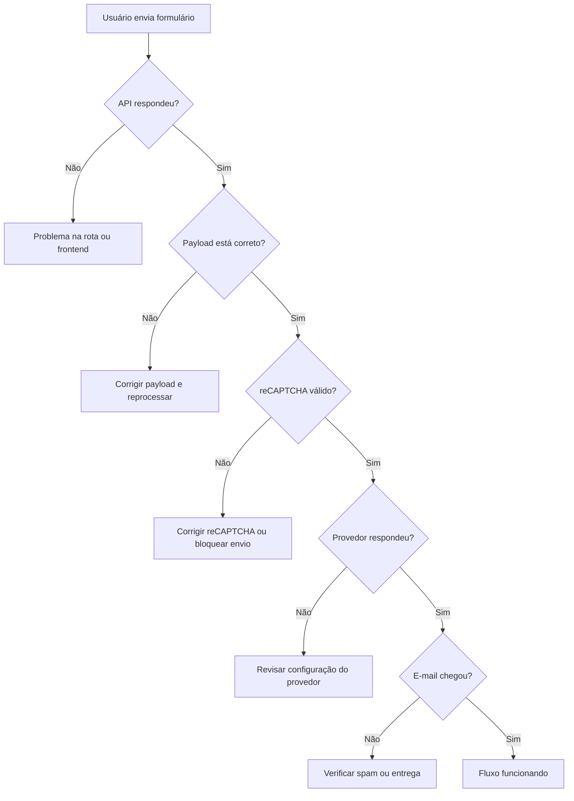

# Manual Operacional de Diagnóstico do Sistema de E-mail

## Objetivo

Este manual tem como finalidade orientar a identificação rápida de problemas quando um formulário do site não entrega a mensagem corretamente.

Ele é voltado para situações em que:

- o formulário mostra sucesso, mas o e-mail não chega
- a mensagem vai para spam
- a mensagem não é enviada por completo
- o e-mail chega com conteúdo mal formatado

---

## Checklist rápido

Antes de aprofundar, confirme estes pontos básicos:

1. O formulário foi enviado de fato?
2. O frontend mostrou sucesso ou erro?
3. A API respondeu com sucesso?
4. O provedor de envio está configurado corretamente?
5. O destinatário e o remetente estão corretos?
6. O reCAPTCHA foi resolvido quando necessário?

Se algum desses itens falhar, siga o fluxo abaixo.

---

## Fluxo de diagnóstico passo a passo

### Passo 1: verificar se o formulário chegou até a API

Comece pelo ponto mais próximo da origem do problema.

O que verificar:

- no navegador, inspecione a resposta do request enviado pelo formulário
- confirme se a rota [src/app/api/contact/route.ts](src/app/api/contact/route.ts) está respondendo
- veja se a resposta é sucesso ou erro

Sinais de problema:

- retorno 500
- resposta com `success: false`
- erro de rede
- ausência de resposta

Se a API não responder, o problema está antes da entrega do e-mail.

---

### Passo 2: revisar o payload enviado

Verifique se os dados enviados estão corretos.

Itens a checar:

- nome
- e-mail
- telefone
- mensagem
- assunto
- replyTo

O arquivo que monta esse payload é:

- [src/components/devsolar/utility/email/SendEmail.ts](src/components/devsolar/utility/email/SendEmail.ts)

Problemas comuns:

- campo `message` vazio
- e-mail inválido ou incompleto
- nome ausente
- payload com campos inesperados

Se o payload estiver incorreto, a mensagem pode chegar mal formatada ou nem ser processada corretamente.

---

### Passo 3: validar o reCAPTCHA, quando aplicável

Em formulários como contato e lead, o reCAPTCHA pode bloquear o envio se não for validado corretamente.

O que verificar:

- o widget carregou corretamente
- o usuário resolveu o desafio
- o token foi capturado no frontend
- o token foi enviado junto com os dados

Arquivos relacionados:

- [src/components/devsolar/utility/recapcha/RecaptchaField.jsx](src/components/devsolar/utility/recapcha/RecaptchaField.jsx)
- [src/components/devsolar/estructure/body/main/contact_section_ds.js](src/components/devsolar/estructure/body/main/contact_section_ds.js)
- [src/components/devsolar/estructure/body/header/ModalCapturaLead.jsx](src/components/devsolar/estructure/body/header/ModalCapturaLead.jsx)

Se o token estiver ausente, o envio pode ser impedido antes de chegar à etapa de envio real.

---

### Passo 4: confirmar a configuração do envio

A configuração do envio fica centralizada em:

- [src/lib/email-config.ts](src/lib/email-config.ts)

Verifique se estas variáveis estão corretas:

- `CONTACT_EMAIL_TO`
- `CONTACT_EMAIL_FROM`
- `CONTACT_EMAIL_FROM_NAME`
- `RESEND_API_KEY`
- `RESEND_FROM_EMAIL`
- `NEXT_PUBLIC_STATICFORMS_KEY`
- `NEXT_PUBLIC_STATICFORMS_ENDPOINT`

Se alguma dessas estiver incorreta, o e-mail pode não ser enviado ou pode ser entregue de forma inesperada.

---

### Passo 5: verificar a rota da API

A rota responsável pelo processamento é:

- [src/app/api/contact/route.ts](src/app/api/contact/route.ts)

Nesse arquivo, confirme se:

- os dados foram extraídos corretamente
- o assunto foi montado
- o corpo do e-mail foi criado
- o remetente foi definido
- o provedor foi chamado corretamente

Se a rota estiver recebendo os dados, mas não enviando, o problema está na camada de encaminhamento do e-mail.

---

### Passo 6: verificar o provedor de envio

O sistema pode usar:

- Resend, quando a API estiver configurada
- StaticForms, como fallback

O que verificar:

- a chave do provedor está válida
- o endpoint está correto
- o provedor respondeu com sucesso
- o destinatário é aceito pelo provedor

Se o provedor responder com erro, a mensagem não será entregue.

---

### Passo 7: analisar se o e-mail foi entregue, mas caiu em spam

Se a mensagem chegou, mas não na caixa principal, o problema provavelmente está relacionado à reputação do remetente ou à configuração do domínio.

Fatores comuns:

- remetente pouco reconhecido
- domínio sem verificação adequada
- conteúdo com indícios de automação
- assunto ou corpo muito genéricos

O que fazer:

- usar um remetente mais explícito
- configurar domínio verificado
- revisar o assunto e o texto do e-mail
- testar com outro provedor se necessário

---

### Passo 8: testar com um cenário simples

Quando tudo estiver confuso, faça um teste mínimo.

Passos recomendados:

1. Envie uma mensagem com dados simples
2. Use um assunto curto e direto
3. Use somente os campos essenciais
4. Teste sem reCAPTCHA, se isso for viável no ambiente
5. Verifique se a mensagem chega

Se o teste simples funcionar, o problema está no formato ou na complexidade do payload original.

---

## Diagnóstico por sintoma

### Sintoma 1: o formulário mostra sucesso, mas o e-mail não chega

Causa provável:

- erro no provedor
- rota da API não encaminhou corretamente
- dados inválidos

Ação:

- revisar a resposta da API
- validar a configuração do provedor
- testar com um payload simples

### Sintoma 2: o e-mail chega no spam

Causa provável:

- reputação do remetente fraca
- falta de verificação do domínio
- conteúdo com sinais de spam

Ação:

- usar remetente mais claro
- ajustar assunto e corpo
- revisar configuração do domínio

### Sintoma 3: o formulário não envia nada

Causa provável:

- validação do frontend
- reCAPTCHA não resolvido
- erro de rede

Ação:

- validar os campos obrigatórios
- confirmar se o reCAPTCHA foi resolvido
- inspecionar a resposta do request

### Sintoma 4: o e-mail chega com conteúdo mal formatado

Causa provável:

- payload com campos inesperados
- corpo montado de forma incorreta

Ação:

- revisar [src/components/devsolar/utility/email/SendEmail.ts](src/components/devsolar/utility/email/SendEmail.ts)
- revisar [src/app/api/contact/route.ts](src/app/api/contact/route.ts)

---

## Fluxo resumido de decisão

---

## Arquivos-chave para consulta rápida

- [src/components/devsolar/utility/email/SendEmail.ts](src/components/devsolar/utility/email/SendEmail.ts)
- [src/app/api/contact/route.ts](src/app/api/contact/route.ts)
- [src/lib/email-config.ts](src/lib/email-config.ts)
- [src/components/devsolar/utility/recapcha/RecaptchaField.jsx](src/components/devsolar/utility/recapcha/RecaptchaField.jsx)
- [src/components/devsolar/estructure/body/main/contact_section_ds.js](src/components/devsolar/estructure/body/main/contact_section_ds.js)
- [src/components/devsolar/estructure/body/header/ModalCapturaLead.jsx](src/components/devsolar/estructure/body/header/ModalCapturaLead.jsx)
- [src/components/devsolar/utility/newsletter/sendNewsletter.ts](src/components/devsolar/utility/newsletter/sendNewsletter.ts)

---

## Conclusão

Quando o e-mail não chega, o ideal é seguir a cadeia de responsabilidade na ordem abaixo:

1. frontend/formulário
2. payload e validação
3. reCAPTCHA
4. API
5. provedor de envio
6. caixa de entrada e spam

Seguir essa ordem reduz a chance de perder tempo com hipóteses erradas e facilita a identificação da causa real.
